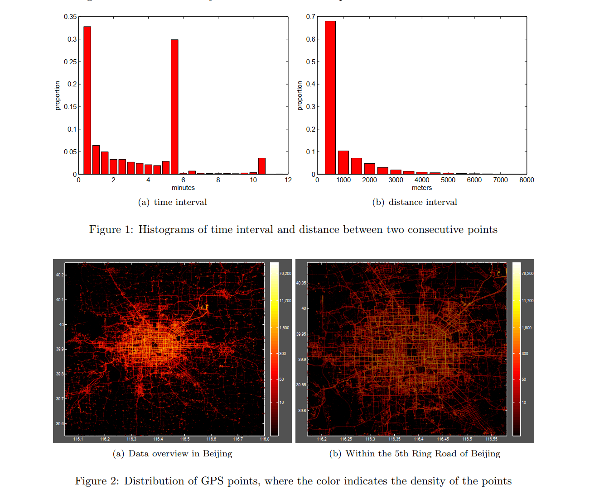
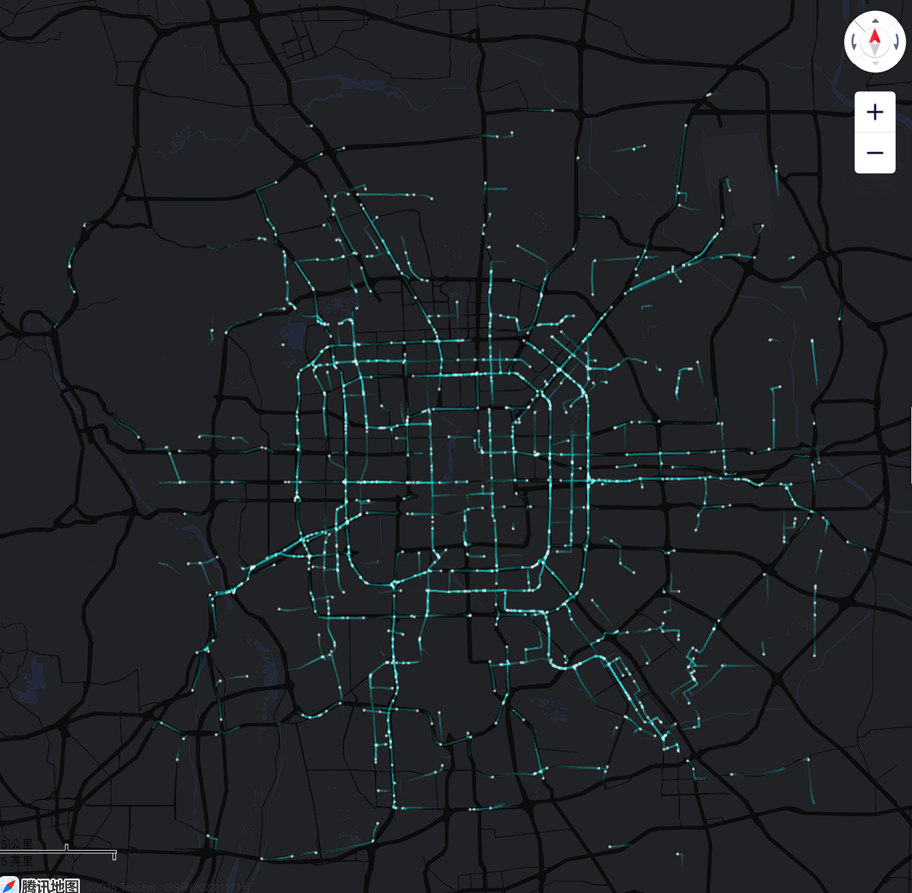
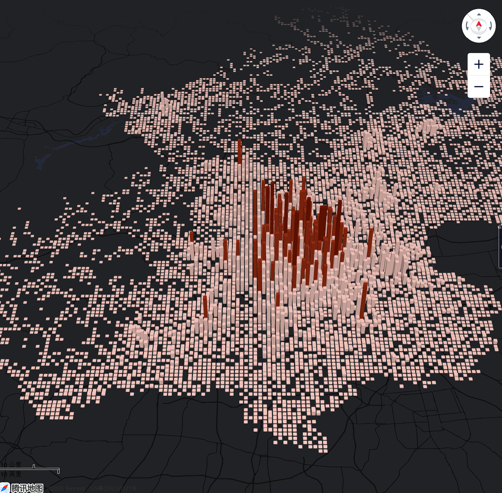
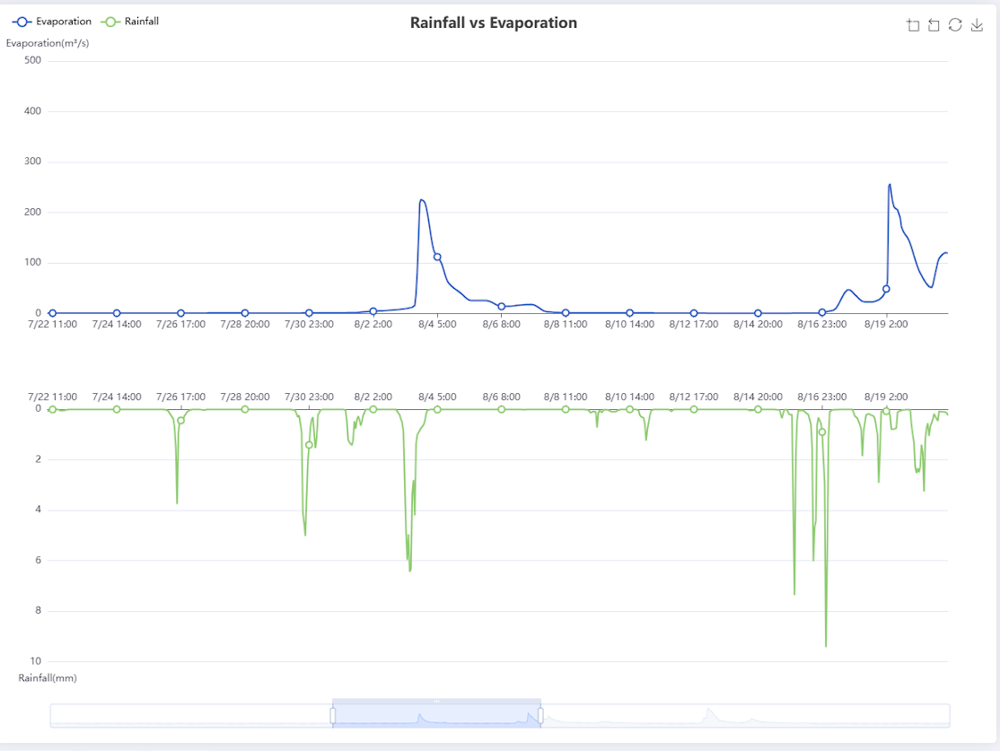
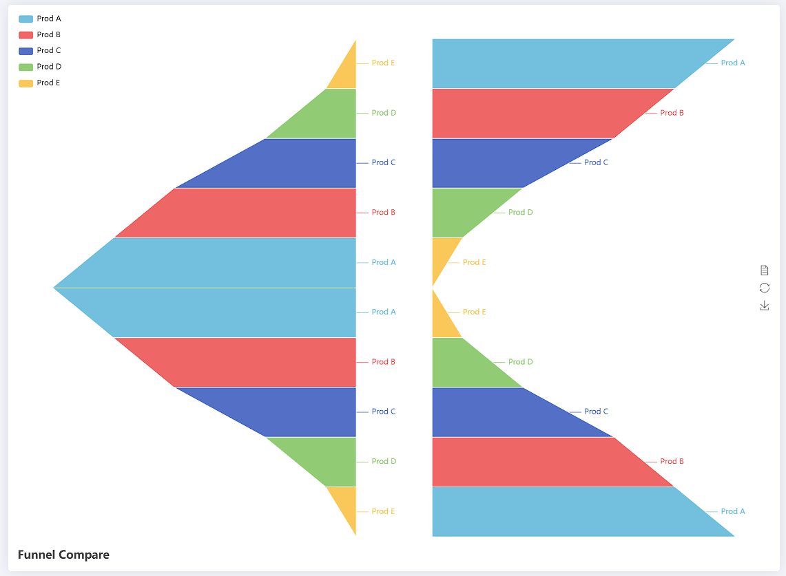

# Taxi-Trajectory-Analysis
## 1.数据配置
### 1.1. 题目叙述
[数据文件01.zip – 014.zip](http://research.microsoft.com/apps/pubs/?id=152883)

将该数据文件解压后，得到10375个txt文件(共 766 MB)。文件记录了北京市10,000辆出租车1星期的GPS轨迹数据。记录的格式如下所示：
```
1,2008-02-02 15:36:08,116.51172,39.92123
1,2008-02-02 15:46:08,116.51135,39.93883
1,2008-02-02 15:46:08,116.51135,39.93883
…
```
每个记录对应一个时空点，其中包含用户标识Id,时间Time，经度longitude，纬度latitude。请基于该数据，进行出租车轨迹的分析。
## 1.2. 文件内的数据说明概要
  本数据集包含2008年2月2日至2月8日期间北京市10,357辆出租车的GPS轨迹数据。数据集总点数约1,500万条，轨迹总里程达900万公里。图1展示了连续两点间时间间隔与距离间隔的分布情况，平均采样间隔约为177秒，平均距离间隔约为623米。每个文件以出租车ID命名，包含单辆车的轨迹数据。图2可视化展示了数据集中GPS点的密度分布。
  

## 2. 技术框架
- **后端**：基于Python的数据算法，包括数据结构的设计，后续题目涉及到的存储、传输、查询、搜索、分析等。
  - 写成**可调用的函数**交给我部署
  - <u>**所有返回的结果都需要转化为json格式**</u>
  - 需要写**简单的API说明**介绍 *参数配置* ， *返回值结构* 和 其他注意事项 以便快速使用；
  - **数据压缩优化：** 例如对位置没有移动的数据进行删减去重，只保留一头一尾

- **前端**：基于Vue2框架的可视化web页面，这部分我可以独立设计和完成；

- **所有人**：针对自己设计的部分撰写课程设计报告书的**公共部分**写入共享文档中，待开发结束后再撰写个人部分，公共部分涉及：
  - 一、选题背景（全部）
  - 二、方案论证（全部）
  - 三、过程论述（前后端之间的交互）
  - 四、结果分析（待商讨）

## 3. 功能要求
#### F1. 出租车轨迹可视化 *(前端已实现,等待后端数据API设计)*
显示**所有**或者**某部**出租车的轨迹。
- 选用**腾讯地图**的JavaScript API，因为其他地图的api都要收费
- 效果如下：

##### (1) 需要的API:
  - **参数：** <u>出租车id的**数组**</u>；
  - **返回值：** 
    - **当有参数传入时**，返回参数数组中id对应出租车的TrailLine构成的**数组**
    - **当没有参数传入或参数为空数组时**，返回**全部**出租车的路径，TraiLine数组,每条TrailLine对应一辆出租车；
    - TrailLine中每个TrailPoint都包含纬度,经度和**时间戳**；
    - ***数据量巨大，可能需要优化算法，例如使用轨迹点抽稀算法（如Douglas-Peucker）简化路径。***

##### (2) 需要的数据格式:
  - [TraiLine数组](https://lbs.qq.com/webApi/visualizationApi/visualizationDoc/visualizationDocTrail#3)
  - [数据样例](https://mapapi.qq.com/web/lbs/visualizationApi/demo/data/trail.js)(仅供参考,没有时间戳,不是我们理想的数据结构)
##### (3) 注意事项:
- 考虑是否需要清洗异常点
- 查询结果为空时的返回值

---
#### F2.地图缩放功能 *(已实现)*
可以对地图进行放大或者缩小，并相应的调整出租车轨迹的展示。

---
#### F3. 区域范围查找
统计在**某个特定的时间段**，用户**指定的矩形区域内**的出租车的**数目**。这里的矩形区域可以通过**给出**矩形的左上角和右下角的经纬度**坐标**来确定。 

前端考虑后期直接实现在地图上框选矩形，再根据坐标查找，对后端无影响。
##### 需要的API:
  - **参数：** 时间段, <u>区域</u>；(<u>带下划线</u>的参数可选，不传则默认不限制范围)
    - 时间段
    ```
      {
      "startTime":格式自定  //在api文档和注释中注明
      "endTime":格式同上
      }
    ```
    - 区域
    ```
      {
      "ltPoint":格式自定  //在api文档和注释中注明
       "rbPoint":格式自定  //在api文档和注释中注明
      }
    ```
  
  - **返回值：** dict
  ```
    {
     "total": Number,
     "path":TrailLine[] # 可截取每条轨迹中对应时段的轨迹，减少传输的数据量
    }
  ```
##### 性能优化：
  考虑构建合适的<u>**索引**</u>加速查询；

---
#### F4. 区域车流密度分析
- 给定距离参数r,将整个地图划分成网格，每个格子的大小是r*r。
统计分析在不同的时间段，经过所有网格区域内的车流密度的变化。
- 预期效果如下：


##### 需要的API:
  - **参数：** 网格宽度
  - **返回值：** [HeatPoint数组](https://lbs.qq.com/webApi/visualizationApi/visualizationDoc/visualizationDocHeat#3)


---
#### F5. 区域关联分析1
- 用户指定两个矩形区域
统计在不同的时间段，**往来这两个区域之间的车流量的变化**。

#### F6. 区域关联分析2。

- 用户指定一个矩形区域
统计**往来该矩形区域和其他区域的车流量随时间的变化**。
- 预期效果图可能如下:

##### 需要的API:
  - **参数：** 时间段，区域1，<u>区域2</u>（<u>带下划线</u>的参数可选，不传则默认不限制范围,即F6）
  - **返回值：**  数组
  ```
  [{"timeStamp": 自定时间格式,
     "flowIn": Number,
     "flowOut":Number  //In和Out针对区域1
  },{...},...]
  ```
##### 性能优化：
- 基于**状态机**识别A→B的移动序列。
- 优化关联查询性能，避免全表扫描。

**以下问题待解决**
---

#### F7. 频繁路径分析1
一条路径的**频繁度**可以定义为这条路径上通行的汽车的总数。
根据用户给定的参数k，距离参数x，统计在整个城市中，长度超过x的最为频繁的前k个路径。

#### F8. 频繁路径分析2
给定两个矩形区域A和B，分析从A到B的最为频繁的前k个通行路径。

##### ds建议：聚类算法识别路径
- 1. ​路径聚类​：
使用轨迹聚类算法（如TRACLUS）识别相似路径。
- 2. ​频繁度计算​：
统计每条路径的车辆数，取Top-K。
- 3. ​可视化​：
在地图上高亮显示频繁路径，标注通行次数。
- 技术要点​：
  - 路径相似度计算采用DTW或LCSS算法。
  - 大数据场景下使用Spark MLlib进行分布式聚类。

---
#### F9. 通时行间分析
给定两个矩形区域A和B，分析在不同的时间段，出租车从A到B的**通行时间最短的路径**，以及相应的**通行时间**。 
##### ds建议
- 1. ​OD点筛选​：
筛选所有起点在A、终点在B的轨迹段。

- 2. 最短时间路径​：
按时间段统计每段轨迹的通行时间（终点时间 - 起点时间）。
取时间最短的路径作为推荐路径。

- 3. ​可视化​：
在地图上绘制最短时间路径，标注平均通行时间。

- ​技术要点​：
  - 排除异常时间差（如超过24小时）。
  - 结合实时交通数据动态更新最短路径。
